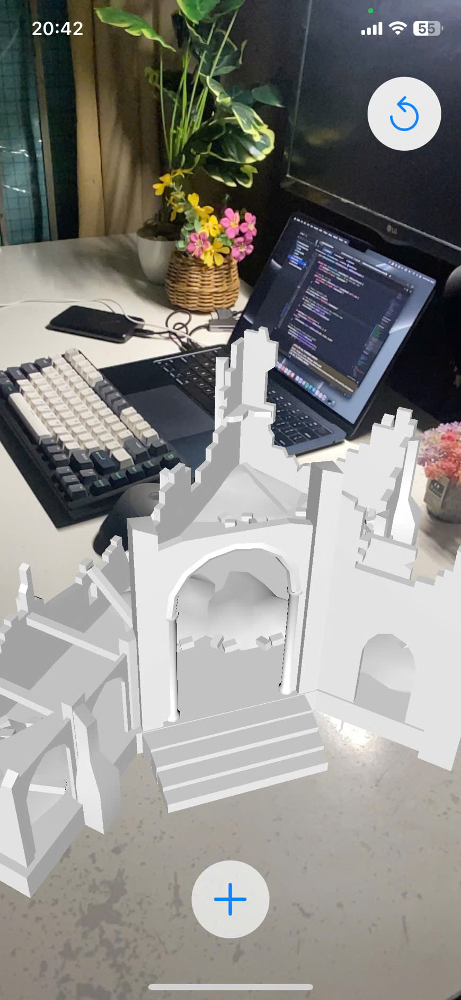

# Immersive Experience Application 👓
 An interactive iOS application leveraging SceneKit, ARKit, and SwiftUI to place, scale, and manipulate 3D models in an augmented reality (AR) environment. The app allows users to dynamically select, place, and reset 3D models while providing a simple and intuitive interface.


 ## Feature
-  Select and place .scn models in an AR environment
-  Detect both horizontal and vertical surfaces for model placement

<p align="center">
  
</p>
  
 ## Requirements
 - iOS 17.0+
 - Xcode 16+
 - Device with ARKit support (iPhone SE (2nd generation) and later)

 ## Installation
 1. Clone the repository:
  ```c 
  git clone https://github.com/KhoanDoanVan/Immersive_3D_Object
```
1. Open the project in Xcode:
```c
cd ImmersiveExperienceApp
open ImmersiveExperienceApp.xcodeproj
```
1. Build and run the app on a physical device (ARKit is not supported on the simulator).